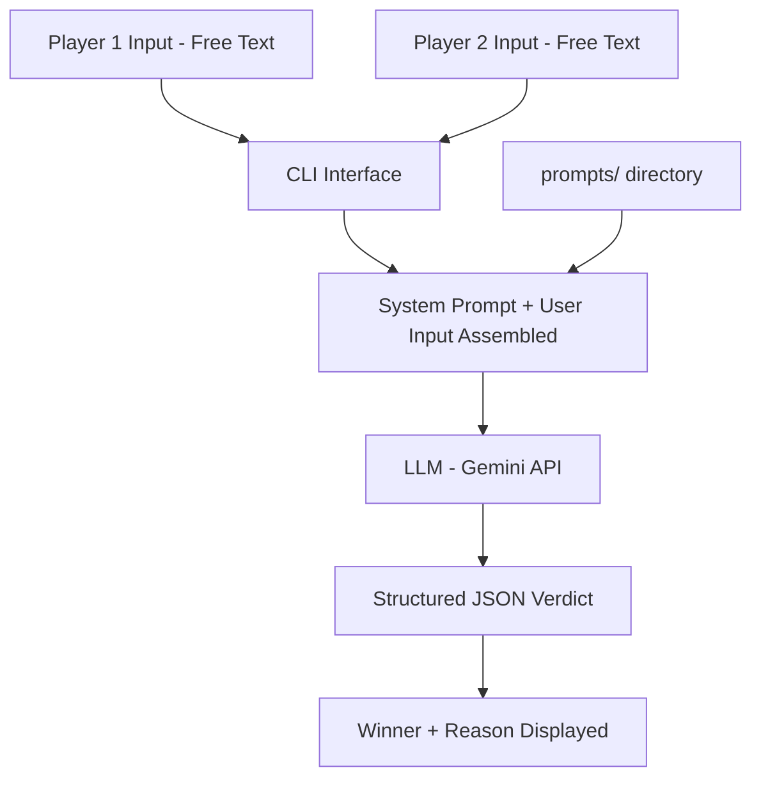

# AI Judge — Rock-Paper-Scissors-Bomb

A prompt-native AI decision agent that evaluates free-text player moves for a Rock-Paper-Scissors-Bomb game and returns structured, explainable verdicts. The engineering focus is on **prompt quality**, **instruction design**, and **ambiguity handling** — not game logic.

## Project Overview

Traditional game judges use rigid if-else logic. This project replaces that entirely with a language model judge driven by a carefully designed system prompt. The judge reads natural language inputs, applies game rules, resolves edge cases, and produces structured JSON verdicts with human-readable reasoning.

**Engineering concept:** Prompt engineering, LLM-as-rule-engine, explainable AI output via instruction design.

## Architecture

## Tech Stack

| Layer           | Technology        |
|-----------------|------------------|
| Language        | Python 3.11+     |
| AI              | Gemini API       |
| Interface       | CLI              |
| Prompt storage  | /prompts directory |

## Project Structure

├── prompts/          # System prompt files  
├── judge.py          # Main judge logic  
├── demo.md           # Example interactions  
├── requirements.txt  
└── README.md  

## How the System Works

1. User provides two player moves in free text  
2. Input is combined with the system prompt from `prompts/`  
3. LLM evaluates input against encoded game rules  
4. A structured JSON verdict is returned: `{ winner, reason, move_a, move_b, valid }`  
5. CLI displays the result with a human-readable explanation

## How to Run Locally

`git clone https://github.com/Jagmohan-Prajapati/AI-judge-rps-plus.git`

`cd AI-judge-rps-plus`

`pip install -r requirements.txt`

`export GEMINI_API_KEY=your_api_key_here`

`python judge.py`

## Example Usage

> Enter Move 1: I throw a rock  
> Enter Move 2: bomb  

Winner: Player 2  
Reason: Bomb destroys Rock. Player 2 wins.  
Validity: Valid moves  

## Prompt Design Principles

The prompts/ directory contains the system prompt built around:
1. Rule encoding — game rules stated declaratively, not procedurally
2. Ambiguity handling — fallback verdicts for unclear or invalid inputs
3. Output format — strict JSON schema enforced through instruction
4. Explainability — every verdict requires a human-readable reason field
